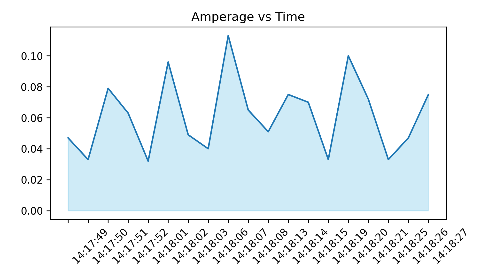
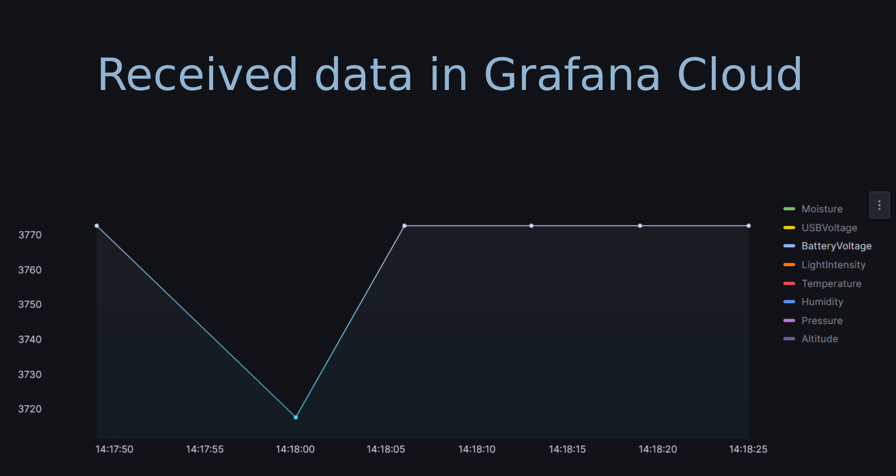

# IoT Flora Bot

In this project I've designed from scratch functional PCB to measure the soil moisture, temperature, humidity and light intensity around the plant. The data is sent to the cloud and displayed on a web page. The system is powered by 3.7 Li-pol battery. The system is designed to be used in a greenhouse or a garden to monitor the plant's health and alert the user when plant needs water, light or temperature is too low.

### Connection to the cloud

For sending the data, I am using the free tier of Grafana Cloud, which allows for 50 GB of data with a retention period of 14 days. This is suitable for this application because we do not need to see historical data if we are not that curious.

### Power consumption

> [!TIP]
> To increase the runtime change the sending interval to a higher value.

$$
Runtime [h] = \frac{Battery\ Capacity [mAh]}{I_{deep\ sleep} [mA]+ I_{sending} [mA]\times\frac{t_{sending} [s]}{3600}\times\frac{60\min}{t_{interval} [min]}} = \frac{1000mAh}{0.7mA+110mA\times\frac{3s}{3600}\times\frac{60\min}{10min}} = 800h
$$

After measurements I've conducted, I measured that the deep sleep amperage is around 0.7mA and peak amperage of sending is 110mA when the average sending time is 3 seconds.

&nbsp; &nbsp; &nbsp; &nbsp;

      

### PCB design

I've designed the PCB using EasyEDA software and manufactured and assembled it using JLCPCB. You can see the project's details and order your own PCBs from the following link:

[TO DO](https://jlcpcb.com)

> [!CAUTION]
> Check the polarity of the battery before connecting it to the PCB. The connector negative pin is marked with a white dot. The battery is connected to the PCB with a JST-PH-2 2mm connector. As there is no uniform standard for colour marking, the colour fitting of this cable may be different in some cases!

### Future improvements

1. Use standardised battery connector to not get the battery polarity wrong.
2. RGB LED is constantly powered from BAT+. It should be powered from battery via transistor activated by GPIO pin to save power.
3. Add holes for mounting the PCB to the 3D printed case.
4. Use a bigger SMD components to make the PCB easier to solder by hand.
